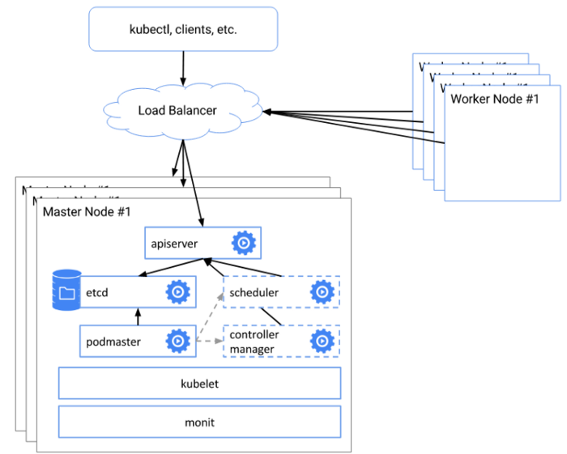
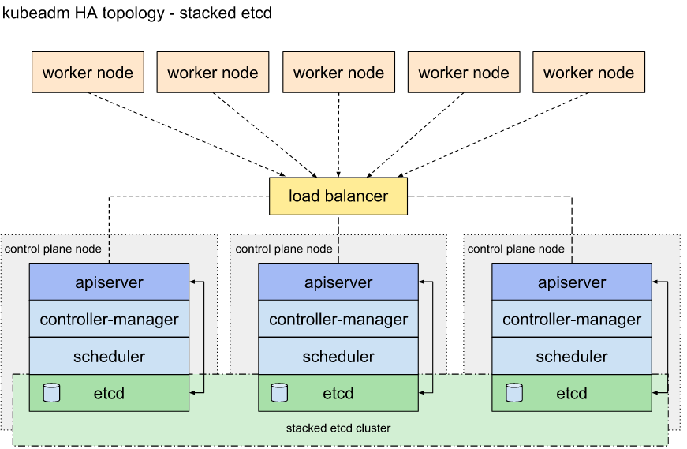

## 아키텍처 
---
### Single Master 아키텍처 

### Multi Master 아키텍처 1

### Multi Master 아키텍처 2

## 1. 서버 
- lb : 192.168.21.29

- master1: 192.168.21.8
- master2: 192.168.21.9
- master3: 192.168.21.10

- worker1: 192.168.21.13
- worker2: 192.168.21.21

## 2. multi-master
---
### 3.1 설치 
  - 설치 TAG : rke2-pre, rke2-cluster-multi-pre,  rke2-cluster-multi  

sh run-vm-rke2-cluster.sh "rke2-pre, rke2-cluster-multi-pre,  rke2-cluster-multi"

### 3.2  개별 tag
- lb: rke2-cluster-multi-pre,  haproxy-lb4-k8s
- master: rke2-multi-master
- agent: rke2-agent-multi-master

### 3.3 삭제
- rke2-multi-master-delete
- rke2-agent-multi-master-delete
- rke2-cluster-multi-delete

### 3.4 트러블슈팅

vm2에 master가 설치되지 않았을 경우 master 삭제 후
- sh run-vm-rke2-cluster.sh "rke2-multi-master-delete"
master 재설치
- sh run-vm-rke2-cluster.sh "rke2-multi-master"
agent 재설치 
- sh run-vm-rke2-cluster.sh "rke2-agent-multi-master"
